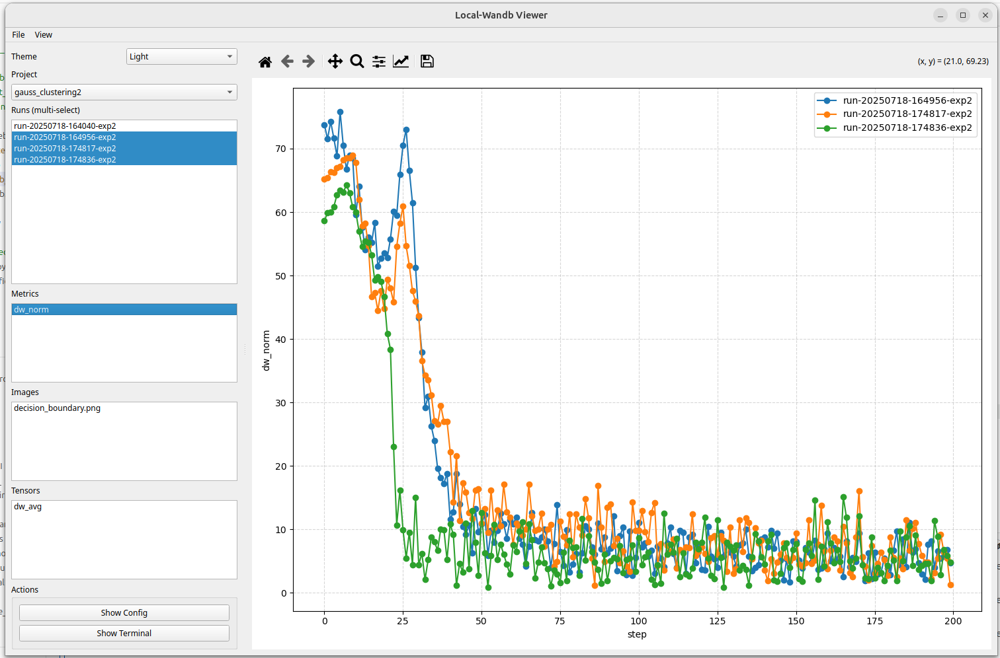
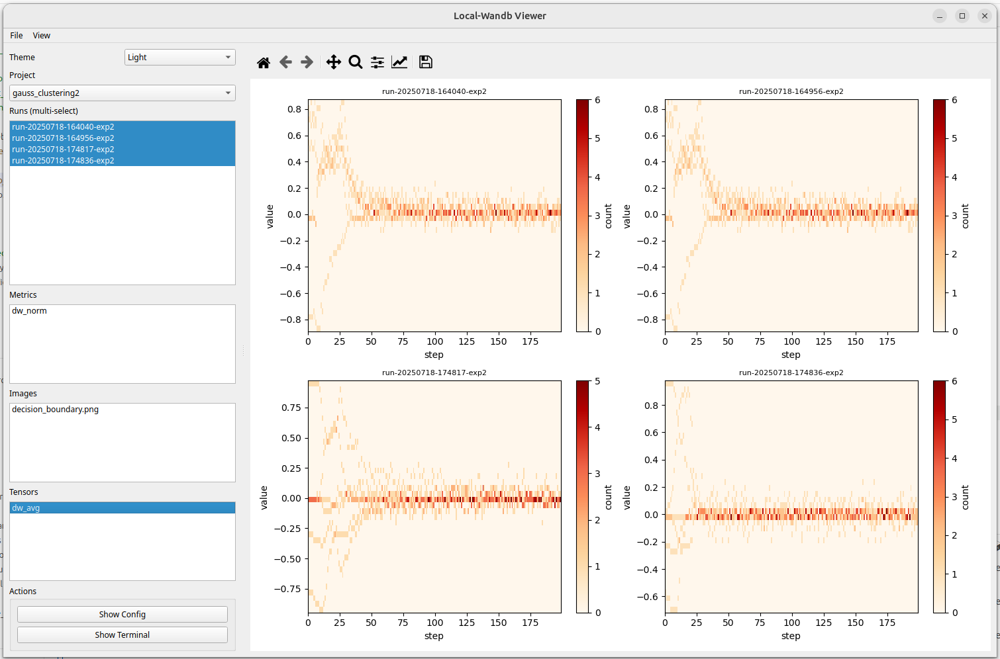

# Local WandB

A lightweight local logging and visualization tool for machine learning experiments. Acts as an offline alternative to `wandb`, providing:

- ✅ Scalar metric logging (e.g., loss, accuracy)
- ✅ Image and Matplotlib figure saving
- ✅ Tensor sequence tracking (e.g., weights over time)
- ✅ Offline GUI visualizations running `local_wandb_ui.py`(need to install PyQt5 package)
- ✅ Support multiple runs selection for metric comparison.
- ✅ And more...

All data is saved under a structured folder in `local_wandb/` in your computer.

---

一款轻量级的本地化 `wandb` 的离线替代方案，提供以下功能：

- ✅ 标量指标跟踪（例如损失函数、准确率）
- ✅ 图像和 Matplotlib 图形保存
- ✅ 矩阵序列跟踪（例如权重随时间的变化）
- ✅ 可运行 `local_wandb_ui.py` 进行离线 GUI 可视化 (需安装PyQt5软件包)
- ✅ 支持多个实验run同时选中进行指标对比
- ✅ 还有更多...


所有数据均保存在你电脑里 `local_wandb/` 的结构化文件夹中。

---
## 🧪 Example Workflow
Put `local_wandb.py` and `local_wandb_ui.py` in the root directory of the project code. 
```python
from local_wandb import LocalWandb

######## create and init run ##############
run = LocalWandb(project="my_project", name="exp1")
run.config({"lr": 0.01})

######## log whatever you want ##############
for step in range(10):
    run.log({"loss": 1 / (step + 1), "acc": step / 10}) # log a scalar
    tensor = torch.randn(1000) * (1 + 0.1 * step)
    run.log_tensor({"weights": tensor}, step) # log a tensor

img = np.outer(np.linspace(0, 1, 100), np.ones(100))
run.log_image({"gradient":img}) # log an image

fig, ax = plt.subplots()
ax.plot([0, 1], [0, 1])
run.log_figure({"diagonal":fig}) # log a figure

######## finish log and close files ##############
run.finish()
```

Then to visualize, run the GUI script `local_wandb_ui.py` 

<div align="center">

</div>
<div align="center">

</div>


---


## 🚀 Getting Started

```python
from local_wandb import LocalWandb

# Create a run
run = LocalWandb(project="my_project", name="experiment_1")
```

This creates a folder:

```
local_wandb/my_project/run-YYYYMMDD-HHMMSS-experiment_1/
```

---

## 🔧 Logging APIs
All log functions take a dict as the first input and step (optional) as the second input.
### 1. Log Config
```python
run.config({
    "lr": 0.01,
    "batch_size": 64,
    "epochs": 10
})
```

### 2. Log Scalar Metrics
```python
for step in range(5):
    run.log({"loss": 0.5**step, "acc": step / 5.0}, step=step)
```

### 3. Log Images
```python
import numpy as np
img = np.random.rand(100, 100)
run.log_image({"name":img}, step=step)
```

### 4. Log Matplotlib Figures
```python
import matplotlib.pyplot as plt
fig, ax = plt.subplots()
ax.plot([0, 1], [1, 0])
ax.set_title("Simple Plot")
run.log_figure({"name":fig}, step=step)
```

### 5. Log Tensor Sequences
```python
import torch
for step in range(5):
    t = torch.randn(1000) * (1 + step * 0.1)
    run.log_tensor({"name":t}, step=step)
```

---

## 📊 Visualization APIs

Visualize data of current run, or reopen a past run in read mode:
```python
runs = LocalWandb.list_runs("my_project")                 # list all runs
run = LocalWandb("my_project", runs[-1], mode="read")     # visualize a specific run
```

### 1. Show Config
```python
run.show_config()
```

### 2. Plot Metrics
```python
run.plot_metrics()              # all metrics
run.plot_metrics(["loss"])     # selected
```

### 3. Show Logged Images
```python
run.show_image("random_noise")
run.show_image("simple_plot")
```

### 4. Visualize Tensor Histograms Over Time
```python
run.plot_tensor_sequence("weights", bins=20)
```

### 5. Show Terminal Outputs
```python
run.show_terminal_output(20) #last 20 lines, 0 for all lines
```

### 6. Compare Metrics Across Multiple Runs
```python
runs = LocalWandb.list_runs("my_project")
run.compare_metrics(project='my_project', metric='loss', runs=runs[-10:]) 
```

---

## ✅ Finalize Logging
```python
run.finish()  # Closes metrics.csv
```

---


## 🗂 Directory Layout
```
local_wandb/
└── my_project/
    └── run-20250627-153000-experiment1/
        ├── config.json
        ├── metrics.csv
        ├── images/
        │   ├── gradient.png
        │   └── diagonal.png
        └── tensors/
            ├── weights_step_0.npy
            ├── weights_step_1.npy
            └── ...
```

---

## 📎 Notes
- Use `mode="write"` to start a new run.
- Use `mode="read"` to explore previous runs interactively.
- `LocalWandb.list_runs(project)` returns available runs.

---

**Enjoy offline experiment tracking, without the cloud.**
